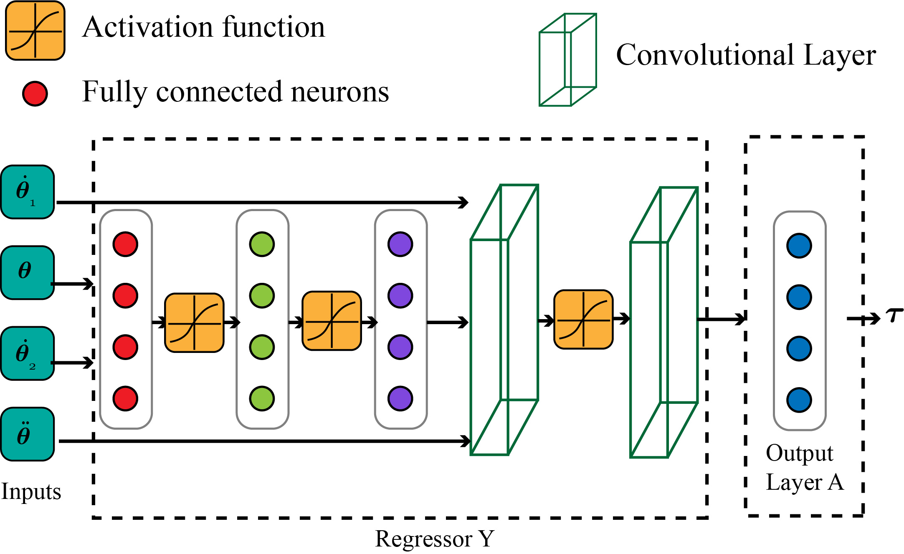
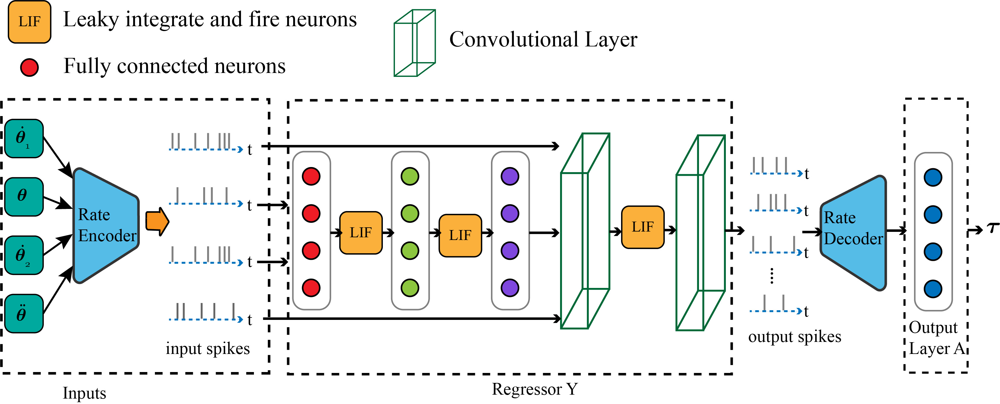
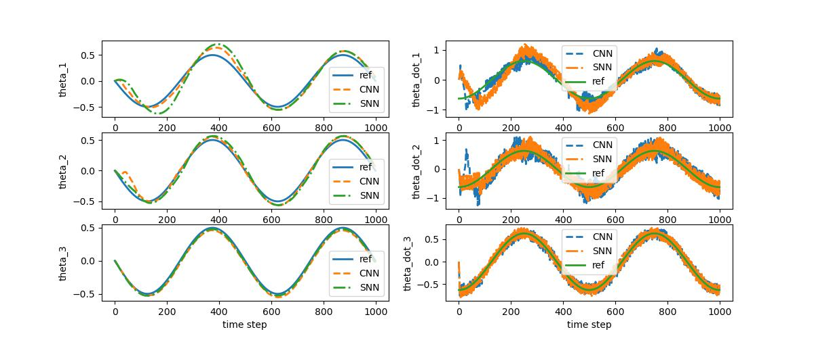

# 1. Spiking neural network-based adaptive control of serial manipulator robots with online learning
We will evaluate the performance of two neural network architectures, one based on nonlinear sigmoid activation functions and the other based on the Leaky integrate and fire (LIF) activation function. 
## Contributions:
- Formulation of a Lyapunov-based adaptation and control law for online learning for serial manipulators
- Comparison of the learning performance of conventional MPL and CNN with spiking neural network

## Architecture 1: Sigmoid activation function

## Architecture 2: LIF activation function

## Comparasion between CNN and SNN for path tracking using a 3R seiral manipulator
### Following presents the angles and angular velocity of a 3R serial manipulator for tracking a referece path for the case when the system parameters are changes by 30%:
